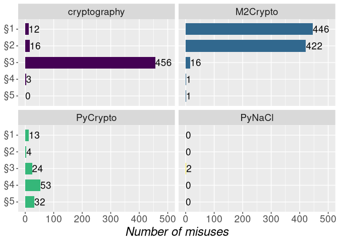
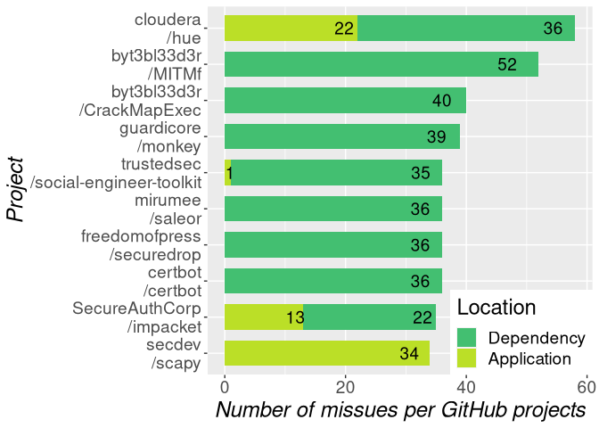

LICMA Evaluation
================

# LICMA Evaluation Python

## Overview Misuses

    ## ℹ Using "','" as decimal and "'.'" as grouping mark. Use `read_delim()` for more control.

    ## Rows: 1501 Columns: 8

    ## ── Column specification ────────────────────────────────────────────────────────────────────────────────────────────────────────────────────────────────────────────────────────────────────────────
    ## Delimiter: ";"
    ## chr (6): File, Rule, Hit-Type, Misuse, Parameter-Value, Parameter-Type
    ## dbl (2): Misuse-Line, Parameter-Line

    ## 
    ## ℹ Use `spec()` to retrieve the full column specification for this data.
    ## ℹ Specify the column types or set `show_col_types = FALSE` to quiet this message.

We got 1501 misuses and 1501 distinct misuses. We have no duplicated
misuse: TRUE.

    ## `summarise()` has grouped output by 'RuleID'. You can override using the `.groups` argument.

    ## Warning: Ignoring unknown aesthetics: width

<!-- -->

## Projects

    ## `summarise()` has grouped output by 'File'. You can override using the `.groups` argument.

We have found misuses in 125 different files and in 81 projects.

<!-- -->

The distribution of the number of misuses per file and project
(*fpmisuses*) and the number of files with a misuses per project
(*filesProject*): Length:125 , Class :character , Mode :character , NA,
NA, NA, Length:125 , Class :character , Mode :character , NA, NA, NA,
Min. : 1.00 , 1st Qu.: 4.00 , Median :18.00 , Mean :12.01 , 3rd
Qu.:18.00 , Max. :18.00 , Min. :1.000 , 1st Qu.:1.000 , Median :2.000 ,
Mean :2.488 , 3rd Qu.:4.000 , Max. :7.000

## Get Number of Projects and Files with Error

    ## [1] 0

In total, we have 20 projects which have files which do not parse. From
these projects, 6 projects have no misuse in another file. In total, we
have 42 projects which have files which hits the maximum recursion. From
these projects, 21 projects have no misuse in another file. Both sources
of errors combined, 61 projects cause an error while analyzing. Of these
projects, 28 projects have no misuse in another file. In total, we
analyzed 155 projects successfully. Of the projects causing an error, 0
projects have no successful analysis of at least one class file.

    ## `summarise()` has grouped output by 'Loc'. You can override using the `.groups` argument.

<!-- -->

    ## [1] 12

    ##    Project                n        
    ##  Length:12          Min.   : 1.00  
    ##  Class :character   1st Qu.: 1.00  
    ##  Mode  :character   Median : 1.50  
    ##                     Mean   : 8.75  
    ##                     3rd Qu.:14.25  
    ##                     Max.   :34.00

## Get the reasons of critical misuses

    ## [1] "cloudera__hue/desktop/core/ext-py/pycryptodomex-3.9.7/lib/Cryptodome/Protocol/KDF.py"

Of the 85 critical misuses, we identified:

  - a misuse due to ECB mode for 13 which covers all hard coded
    attribute misuses: TRUE. ECB was used as encryption mode within 5
    projects. All misuses due to ECB are misuse due to rule 1 (should
    be): TRUE.
  - a hard coded byte for AES.new and improper init (Rule 2): 8 within 6
    projects.
      - Example of a static IV:
        <https://github.com/SecureAuthCorp/impacket/blob/master/impacket/krb5/crypto.py#L435>
  - a constant encryption key (Rule 3): 14 misuses within 2 projects
      - Example of a static key:
        <https://github.com/secdev/scapy/blob/master/scapy/layers/tls/crypto/cipher_stream.py#L57>
        (parameter) within line
        <https://github.com/secdev/scapy/blob/master/scapy/layers/tls/crypto/cipher_stream.py#L62>
      - For two projects, these are duplicates due to scapy (repo &
        dependency)
  - a constant salt for PBE (Rule 4): 18 misuses within 14 projects
      - Example of a constant salt:
        <https://github.com/jrnl-org/jrnl/blob/develop/jrnl/EncryptedJournal.py#L31>
      - Another example like in our business study that the value is
        empty if the loop isn’t entered:
        <https://github.com/cloudera/hue/blob/master/desktop/core/ext-py/pycryptodomex-3.9.7/lib/Cryptodome/Protocol/KDF.py#L405>
  - Fewer than 1000 iterations (Rule 5): 32 misuses within 13 projects
      - a hard coded int PDKDF2 for 32 within 13 different projects. All
        (TRUE) misuses due to a hard coded integer value have the value
        1 (iteration count should be higher than 1000).
          - Example that iteration count is one:
            <https://github.com/cloudera/hue/blob/8aa24a89648ab7c079cbce7369481fefbc05efc7/desktop/core/ext-py/pycryptodomex-3.9.7/lib/Cryptodome/Protocol/KDF.py#L385>
          - Example that iteration count is one:
            <https://github.com/cloudera/hue/blob/8aa24a89648ab7c079cbce7369481fefbc05efc7/desktop/core/ext-py/pycryptodomex-3.9.7/lib/Cryptodome/Protocol/KDF.py#L406>
  - 18 distinct projects are affected by critical misuses.

<!-- -->

## Further investigations to understand the data

### Dependencies within the application code via the *ext-py* folder

In total, we have 22 (20.952381) misuses with *ext-py* within the path
name. This affects 1 different projects.

## Graphs for the Paper

    ## `summarise()` has grouped output by 'Project'. You can override using the `.groups` argument.

    ## Warning: Ignoring unknown aesthetics: width

<!-- -->
