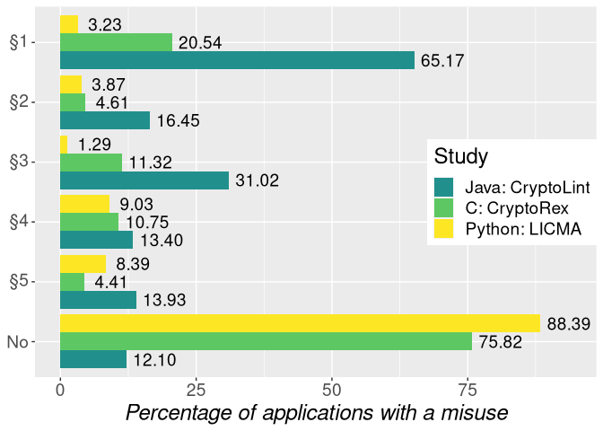

LICMA Meta-analysis
================

# LICMA Meta-analysis

## Misuses per Rule for LICMA

    ## ℹ Using "','" as decimal and "'.'" as grouping mark. Use `read_delim()` for more control.

    ## Rows: 1501 Columns: 8

    ## ── Column specification ──────────────────────────────────────────────────────────────────────────────────────────────────────────────────────────────
    ## Delimiter: ";"
    ## chr (6): File, Rule, Hit-Type, Misuse, Parameter-Value, Parameter-Type
    ## dbl (2): Misuse-Line, Parameter-Line

    ## 
    ## ℹ Use `spec()` to retrieve the full column specification for this data.
    ## ℹ Specify the column types or set `show_col_types = FALSE` to quiet this message.

    ## `summarise()` has grouped output by 'RuleID'. You can override using the `.groups` argument.

| RuleID |  n |      perc |
| :----- | -: | --------: |
| 1      | 13 | 15.294118 |
| 2      |  8 |  9.411765 |
| 3      | 14 | 16.470588 |
| 4      | 18 | 21.176471 |
| 5      | 32 | 37.647059 |

Distribution of Misuses to Rules for Critical Misuses

| RuleID |  n |     perc |
| :----- | -: | -------: |
| 1      |  5 | 3.225807 |
| 2      |  6 | 3.870968 |
| 3      |  2 | 1.290323 |
| 4      | 14 | 9.032258 |
| 5      | 13 | 8.387097 |

Distribution of Projects with at least one Misuse of one Rule for
Critical Misuses

## Misuses per Rule for CryptoLint

The Evaluation by Egele et al. focuses on the number of apps which
violates one rule rather than the total number of observed misuses per
rule.

| RuleID |    n |     perc |
| :----- | ---: | -------: |
| 1      | 7656 | 65.16854 |
| 2      | 1932 | 16.44535 |
| 3      | 3644 | 31.01805 |
| 4      | 1574 | 13.39803 |
| 5      | 1636 | 13.92577 |
| No     | 1421 | 12.09568 |

Distribution of Projects with at least one Misuse of the Respective Rule

## Misuses per Rule for CryptoRex

The evaluation by Zheng et al. may missed to discuss how many of the
firmware images do not use crypto. While their describe filtering for
crypto usages, their text read as that the **521** firmware images are
before the filter step. Thus, the percentages are for misuses may be
upon the unfiltered data set.

| RuleID |   n |      perc |
| :----- | --: | --------: |
| 1      | 107 | 20.537428 |
| 2      |  24 |  4.606526 |
| 3      |  59 | 11.324376 |
| 4      |  56 | 10.748560 |
| 5      |  23 |  4.414587 |
| No     | 395 | 75.815739 |

Distribution of Firmware images with at least one misuse of the
respective rule

## Graphs

<!-- -->
